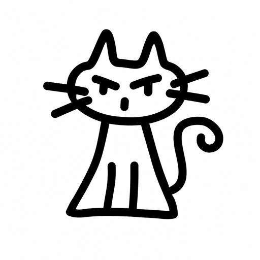

# Fitkit

> **Proprietary software — property of Fitkit.** "Fitkit" is the trade name
> of the project's founder and owner, Ivan Krykun.
> Unauthorized redistribution of the source code is prohibited. Every
> collaborator of this repository is granted the right to view and edit it:
> if you can read this, that means you. Full terms: [LICENSE](LICENSE).

Fitkit turns Pinterest saves into a shopping list: save an outfit, tap the
pin, get each piece with store listings and prices.

## Philosophy

- **Purchase is the product.** Every screen exists to make buying easier;
  anything that doesn't, gets out of the way.
- **Fewest taps possible.** Core actions take as few clicks as we can make
  them — one tap from pin to shoppable pieces is the bar.
- **Native wherever possible.** Platform-native implementations over
  abstractions and web views; the platform's way is the default.
- **API calls are budget.** An action that earns nothing spends as few API
  calls as possible — ideally zero. Paid calls go only toward purchases.

## Documentation

- [Onboarding & internals](docs/onboard.md) — setup, architecture, API
- [Spec](docs/spec.md) · [Plan](docs/plan.md) · [MVP plan](docs/mvp-plan.md)
